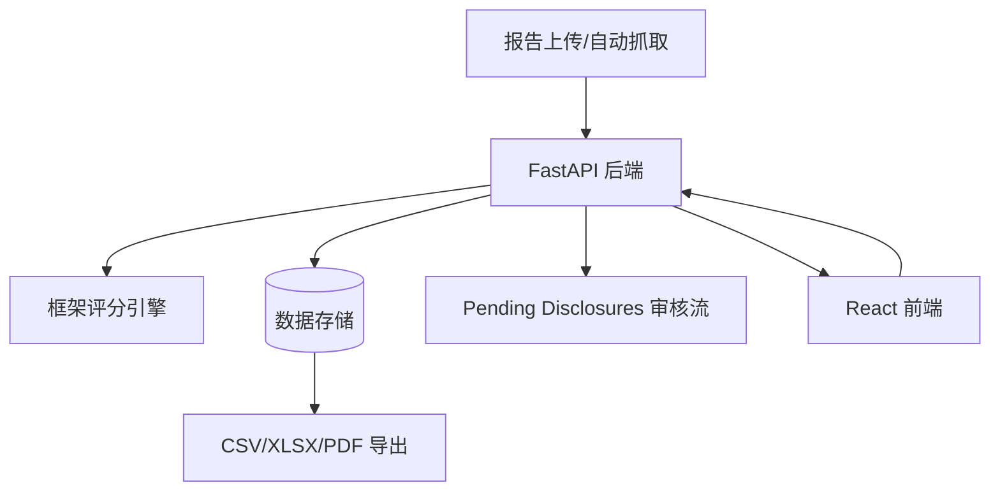

# CONTEXT — esg-research-toolkit
## 目的
提供企业 ESG 报告解析、多框架评分与合规缺口分析的一体化研究与交付平台。
## 当前阶段
活跃开发阶段；后端 FastAPI 与前端 React 已形成可运行闭环，并维护前端健康检查流程。
## 痛点
- 多框架口径（EU Taxonomy/CSRC/CSRD）并存，指标一致性和解释一致性维护成本高。
- 文件解析、自动抓取、人工审核混合流程长，端到端回归面较大。
- 前后端与报告导出链路耦合，任何接口变更都可能影响多个视图与导出产物。
## 架构概览（Mermaid）

## 约束
- 非 trivial 任务需先执行跨 AI trace 检索并回写稳定结论。
- 变更需满足后端 pytest 与前端 lint/build/smoke/a11y/health 基线。
- 不泄露密钥与本地私有运行态信息。
## 开发需求（下一步）
- 提升跨框架评分规则的可解释性与可追踪版本化。
- 为自动抓取与人工审核补强失败重试与质量度量。
- 持续降低前端健康检查中的脆弱点。
## 技术栈
- Python 3.12+, FastAPI
- React 19 + Vite + TypeScript（`frontend/package.json`）
- Docker Compose（本地整栈运行）
## 相关 Repo
- `projects/sustainos`（同属可持续性领域）
- `tools/automation`（traceability 与协作规范）
