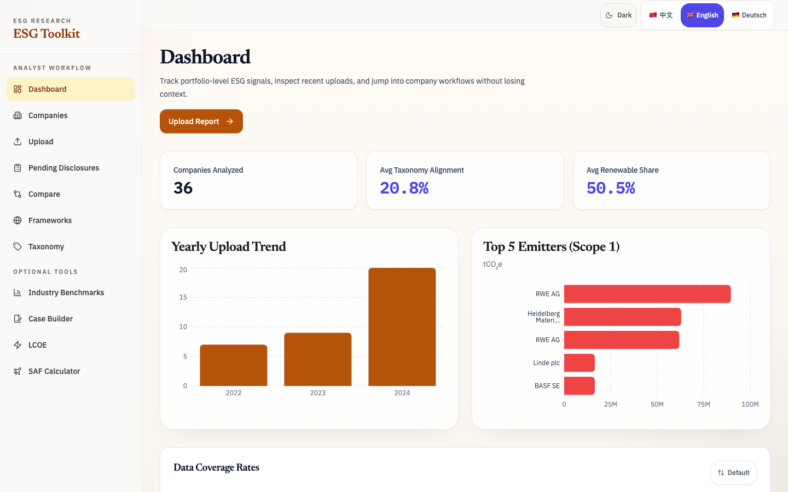
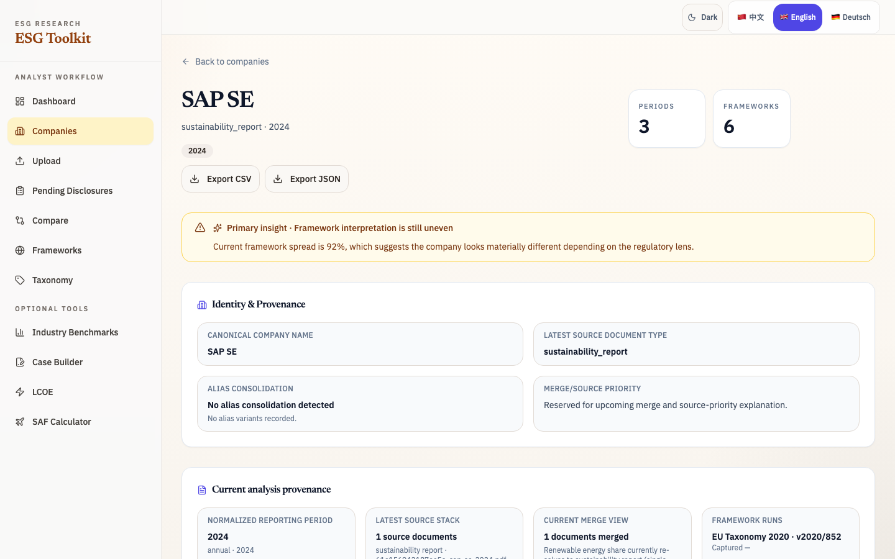
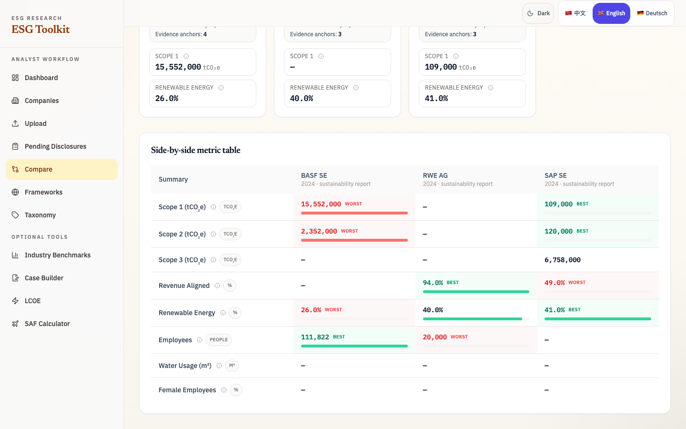

# ESG Research Toolkit

🌐 [English](README.md) · [中文](README.zh.md) · [Deutsch](README.de.md)

> 面向公开企业可持续发展披露的证据型分析师工作台：
> 导入官方报告，审核抽取证据，按期间追踪公司历史，
> 对比不同框架解释，并导出可辩护的分析包。

**🔗 在线演示：** [esg.meichen.beauty](https://esg.meichen.beauty) — 已载入经验证的真实报告数据集（21 家欧洲上市公司，2022–2024）。

   

## ✨ 功能特性

- 📄 解析上传的年度可持续发展报告与公司披露，并抽取结构化指标。
- 🎯 **公司+年份缺口选择器**：高亮已导入/缺失年份，点击缺失年份直接深链到上传 / 自动抓取流程。
- 📥 **Pending Disclosures 审核台**：对官方来源（公司官网、SEC EDGAR、HKEX、中国证监会/CNINFO）自动抓取的披露做字段级审批，按来源通道可靠性排序推荐。
- 🔎 保留来源文件上下文、期间元数据，以及关键指标的证据锚点。
- 🧠 在 EU Taxonomy 2020、中国证监会 CSRC 2023、欧盟 CSRD/ESRS 风格界面之间做带版本上下文的多框架评分。
- 📈 通过标准化的来源/期间/证据摘要对比公司与期间。
- 📊 支持公司记录导出为 CSV/XLSX，并生成 PDF 报告供外部审阅。
- 🔬 将 LCOE、SAF 和可再生能源经济性保留为可选分析工具，而不是首要演示路径。
- 🖥️ 提供 React 前端，覆盖公司历史、披露审核、对比、框架分析与导出流程。
- 💱 LCOE 区域化默认值（EUR / USD），英文 UI 下附带 EIA 美国批发电价参考面板。
- 🐳 支持 Docker 本地部署，持久化 `data/` 与 `reports/`。

## Analyst Workflow

主流程刻意保持窄而可重复：

```text
缺失年份的公司
  -> 上传或自动抓取
  -> Pending Disclosures 审核
  -> Company Profile 趋势与证据
  -> Framework Compare
  -> CSV/XLSX/PDF 交付包
```

第一个强 MVP 应证明：分析师能够解释一家公司的披露质量与监管准备度如何随时间变化，并且每个重要判断都能回到对应报告期间与来源文件。可再生能源经济性工具仍可用于更深入的项目分析，但不是默认产品叙事。

## 📸 界面截图

| 仪表盘 | 公司档案 | 公司对比 |
|---|---|---|
|  |  |  |

## ✅ 真实数据验证

抽取精确率（precision）已用 **35 份真实企业报告（34 份已验证；1 份 PDF 缺失；21 家欧洲上市公司，2022–2024，719 MB 原始 PDF）** 验证，方法为确定性离线匹配器 + 人工证据复核；这里衡量的是已抽取值的 precision，recall 尚未量化（见 audit 报告第 6 节）：

| 指标 | 结果 |
|---|---|
| 抽取值与原文 PDF 核对正确（precision） | **96.1 %**（146/152） |
| 扩展数值字段可追溯到原文 PDF 文本层 | **98.3 %**（237/241） |
| 确认的抽取错误 | 1 处（单位缩放错误，已修正并保留审计轨迹） |
| 待复核（needs_review） | 5 处 |

> **案例——抓出一个 10 倍单位错误。** SAP 2022 年用水量被抽取为 8,780,000 m³。
> 离线校验器在任何用水相关页面都找不到这个数字；人工对照原报告（第 290 页）
> 发现原文是 *"878 thousand cubic meters"*——单位缩放误读。该值已修正为
> 878,000 m³，并保留只追加的审计轨迹。确定性匹配器标记 → 人工裁定 →
> 带证据修正记录，正是本工具要支撑的核心工作流。

已知失败模式：单位缩放混淆（"thousand m³"）、基线重述、PDF 表格乱序、数值嵌入图表。完整报告见
[`docs/audits/stage6-real-data-validation-2026-06-10.md`](docs/audits/stage6-real-data-validation-2026-06-10.md)，
可用 `scripts/verify_extractions_offline.py` 复现。

## 🚀 快速开始

### 前置要求

- Python 3.12+
- Node.js 18+
- Docker（可选）

### 本地开发

1. 克隆仓库并进入目录：

```bash
git clone https://github.com/wyl2607/esg-research-toolkit.git
cd esg-research-toolkit
```

2. 安装后端依赖并启动 FastAPI：

```bash
python3 -m venv .venv
source .venv/bin/activate
pip install -r requirements.txt
cp .env.example .env
uvicorn main:app --reload --port 8000
```

3. 在新终端启动前端开发服务：

```bash
cd frontend
npm install
npm run dev
```

### 工作日前端健康检查

运行完整前端健康检查（lint、build、Playwright smoke、axe、Lighthouse）：

```bash
cd frontend
npm run health:check
```

当检查发现失败、bundle 回归、明显布局问题或新的 console/network 错误时，汇总报告会生成在：

```text
frontend/health-reports/latest/summary.md
```

### Docker

使用 Docker Compose 一键启动后端栈：

```bash
cp .env.example .env
docker-compose up -d --build
```

Backend API 默认暴露在 `http://localhost:8000`。

## 📡 API 参考

下表由 `main.py` 当前 FastAPI 路由自动整理。

| Method | Endpoint | 说明 |
|---|---|---|
| GET | `/` | 根路径信息与基础可用性响应。 |
| GET | `/docs` | Swagger UI 交互式 API 文档。 |
| GET | `/docs/oauth2-redirect` | Swagger UI 使用的 OAuth 回调辅助路径。 |
| GET | `/frameworks/compare` | 对比不同 ESG 框架的评分结果。 |
| GET | `/frameworks/list` | 获取已支持 ESG 框架列表与元信息。 |
| GET | `/frameworks/score` | 通过查询参数执行跨框架评分。 |
| POST | `/frameworks/score/upload` | 上传报告并触发跨框架评分。 |
| GET | `/health` | 服务健康检查接口。 |
| GET | `/openapi.json` | OpenAPI Schema 文档。 |
| GET | `/redoc` | ReDoc 风格 API 文档页。 |
| GET | `/report/companies` | 查询已存储公司报告记录列表。 |
| GET | `/report/companies/v2` | 带年份覆盖信息的公司列表（驱动缺口感知选择器）。 |
| POST | `/disclosures/fetch` | 针对 `(公司, 年份)` 发起官方来源自动抓取。 |
| GET | `/disclosures/pending` | 获取待审核的自动抓取披露列表。 |
| POST | `/disclosures/{id}/approve` | 将选中字段的待审披露合入公司历史。 |
| POST | `/disclosures/{id}/reject` | 按备注驳回一条待审披露。 |
| GET | `/disclosures/lane-stats` | 按来源通道的抓取可靠性遥测与推荐顺序。 |
| GET | `/report/companies/export/csv` | 导出公司记录为 CSV。 |
| GET | `/report/companies/export/xlsx` | 导出公司记录为 Excel。 |
| GET | `/report/companies/{company_name}/{report_year:int}` | 按公司与年份获取单条记录。 |
| DELETE | `/report/companies/{company_name}/{report_year:int}` | 硬删除对应公司记录。 |
| POST | `/report/companies/{company_name}/{report_year:int}/request-deletion` | 创建记录删除申请流程。 |
| GET | `/report/jobs/{batch_id}` | 查询批量上传任务状态。 |
| POST | `/report/upload` | 上传并解析单个 ESG 报告。 |
| POST | `/report/upload/batch` | 批量上传并解析多个 ESG 报告。 |
| GET | `/taxonomy/activities` | 获取 taxonomy 活动目录。 |
| POST | `/taxonomy/report` | 由结构化输入生成 taxonomy 报告。 |
| GET | `/taxonomy/report` | 按公司/年份读取 taxonomy 报告。 |
| GET | `/taxonomy/report/pdf` | 生成并下载 taxonomy PDF 报告。 |
| POST | `/taxonomy/report/text` | 生成 narrative 文本版 taxonomy 报告。 |
| POST | `/taxonomy/score` | 基于输入指标执行 EU Taxonomy 评分。 |
| GET | `/techno/benchmarks` | 获取技术经济分析基准参数。 |
| POST | `/techno/lcoe` | 计算项目 LCOE。 |
| POST | `/techno/sensitivity` | 运行技术经济敏感性分析。 |

## 🛡 Auto-Fetch 合规边界（F2）

披露补录链路（`POST /disclosures/fetch` + Upload 页待审核队列）默认受以下约束：

- **支持的官方来源通道：** 公司官网披露页、SEC EDGAR、HKEX、CSRC/CNINFO。
- **明确排除：** 付费/专有 ESG 数据商，以及第三方爬虫聚合站。
- **请求标识：** 抓取请求携带项目 User-Agent（`esg-research-toolkit/<ver> (+contact)`）。
- **速率与入库策略：** 限制 host 级节奏与全局并发；抓取结果先写入 `pending_disclosures`，必须经人工 approve/reject 后才可并入主表。

## 🏗 架构

```text
React Frontend (Vite)
        |
        v
      Nginx
        |
        v
 FastAPI Backend (main.py)
        |
        v
 SQLite (data/esg_toolkit.db) + File Reports (reports/)
```

前端负责分析师工作流：公司/年份覆盖、上传、官方来源披露审核、公司档案趋势、框架对比与导出。FastAPI 提供导入、评分、审核与报告 API。持久化数据存储在 SQLite，生成文件输出到 `reports/`。

## 🌍 多框架 ESG

### EU Taxonomy 2020

EU Taxonomy 以活动级标准和收入/CapEx/OpEx 对齐比例衡量环境合规性。项目中实现了 DNSH 检查与面向缺口的建议生成。

### 中国证监会 CSRC 2023

CSRC 2023 聚焦上市公司 ESG 强制信息披露，覆盖 E/S/G 三个维度。工具可将报告提取结果映射为 CSRC 兼容评分输出。

### 欧盟 CSRD / ESRS

CSRD/ESRS 对环境、社会与治理提出更广泛披露要求。平台支持跨框架并排对比，帮助识别重叠项与差异项。

## 📊 前端页面

- `DashboardPage.tsx`：展示整体 KPI 看板与高层评分、趋势区块。
- `UploadPage.tsx`：单文件/批量文件上传与解析入口（识别 `?company=&year=` 深链并提示缺口补录）。
- `PendingDisclosuresPage.tsx`：官方来源自动抓取披露的 analyst 审核工作台（`/disclosures`）。
- `CompanyProfilePage.tsx`：多期间公司档案，包含标准化期间、来源文件、框架与证据上下文。
- `ComparePage.tsx`：公司并排对比，包含标准化来源/期间/证据摘要。
- `FrameworksPage.tsx`：框架导向评分与标准视图。
- `TaxonomyPage.tsx`：EU Taxonomy 评分与报告生成工作区。
- `LcoePage.tsx`：可选技术经济计算器，输出 LCOE 与敏感性分析。
- `SafPage.tsx`：可选可持续航空燃料成本计算器。
- `CompaniesPage.tsx`：已保存公司记录、查询与导出操作。

## 🔧 配置说明

环境变量通过 `.env` 加载。

| 变量 | 示例 | 说明 |
|---|---|---|
| `OPENAI_API_KEY` | `sk-...` | 用于模型增强解析与补全功能。 |
| `APP_ENV` | `development` | 运行环境模式，影响日志与开关策略。 |
| `APP_HOST` | `0.0.0.0` | 后端绑定主机地址。 |
| `APP_PORT` | `8000` | 后端监听端口。 |
| `CORS_ALLOWED_ORIGINS` | `http://localhost:5173,http://localhost:4173` | 允许的浏览器来源，逗号分隔；生产环境必须显式设置部署域名。 |
| `ADMIN_API_TOKEN` | 空 | 破坏性管理接口需要通过 `X-Admin-Token` 提供的可选 token；`APP_ENV=production` 时必须设置。 |
| `DATABASE_URL` | `sqlite:///./data/esg_toolkit.db` | SQLAlchemy 数据库连接字符串。 |
| `ARXIV_MAX_RESULTS` | `20` | 文献流水线单次检索上限。 |
| `ARXIV_DOWNLOAD_PDF` | `true` | 是否下载文献 PDF。 |
| `LOG_LEVEL` | `INFO` | 日志输出级别。 |
| `BATCH_MAX_WORKERS` | `2` | 批量解析任务并发 worker 数。 |

## 🗄️ 数据库初始化（Alembic 优先）

使用 Alembic 应用数据库 schema 变更：

```bash
./scripts/db_init.sh
# or
alembic upgrade head
```

如果生产数据库已经存在 schema 或业务数据，请先遵循：

- `docs/runbooks/alembic_cutover.md`（包含 `alembic stamp 0001_baseline` + `alembic upgrade head` 流程）

兼容性说明：

- `scripts/migrate_db.py` 仅作为旧入口兼容 shim 保留，会输出 Alembic 指引，不再直接写 schema。

## 🤝 贡献指南

1. Fork 本仓库并创建特性分支。
2. 为行为变更补充或更新测试。
3. 本地完成检查后再提交 Pull Request。
4. 在 PR 中写清范围、验证证据和必要迁移说明。

## 📄 许可证

MIT
